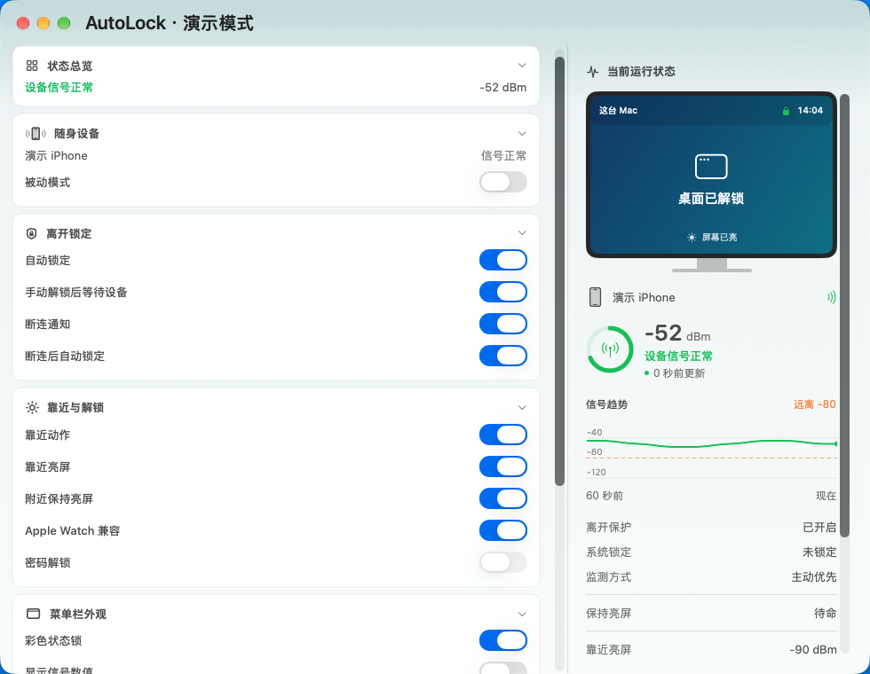
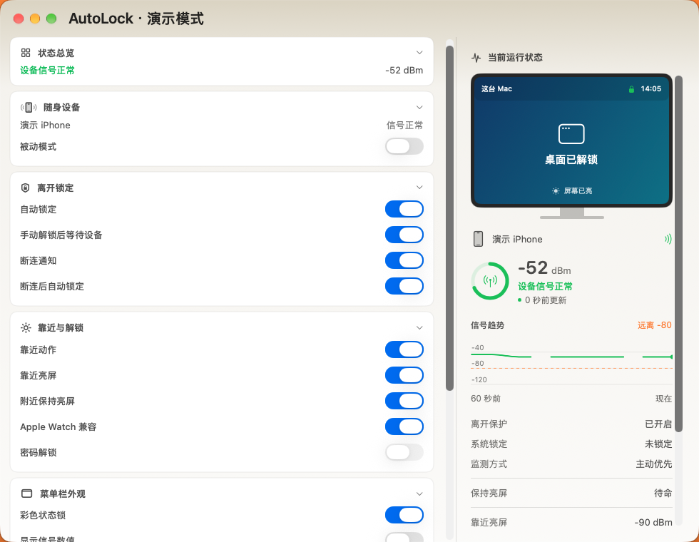
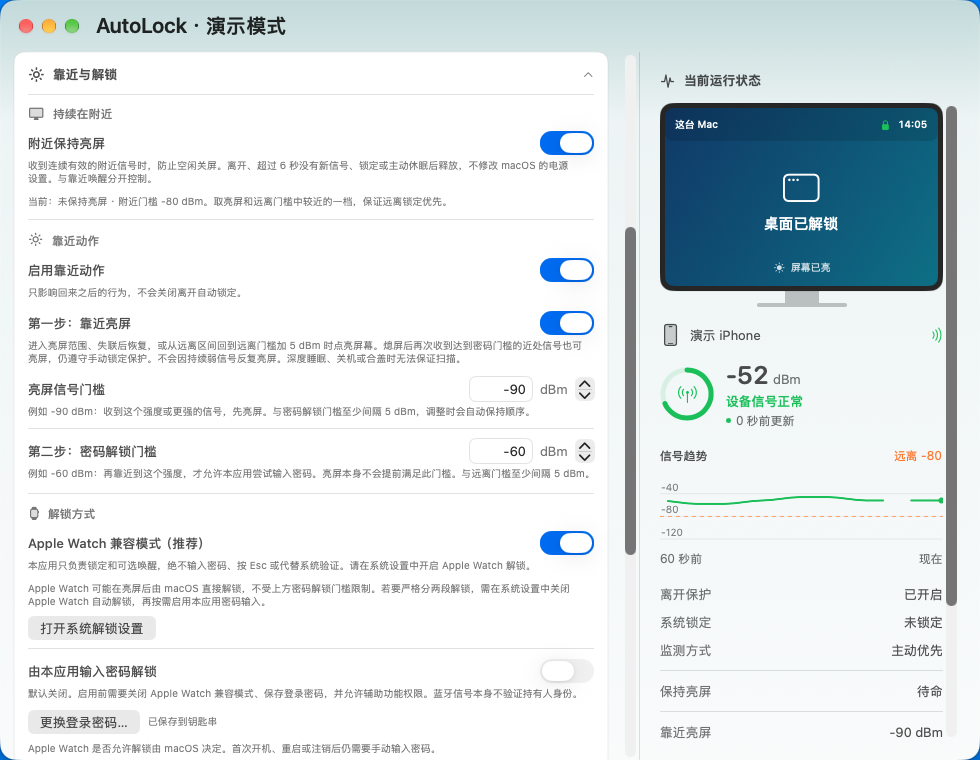
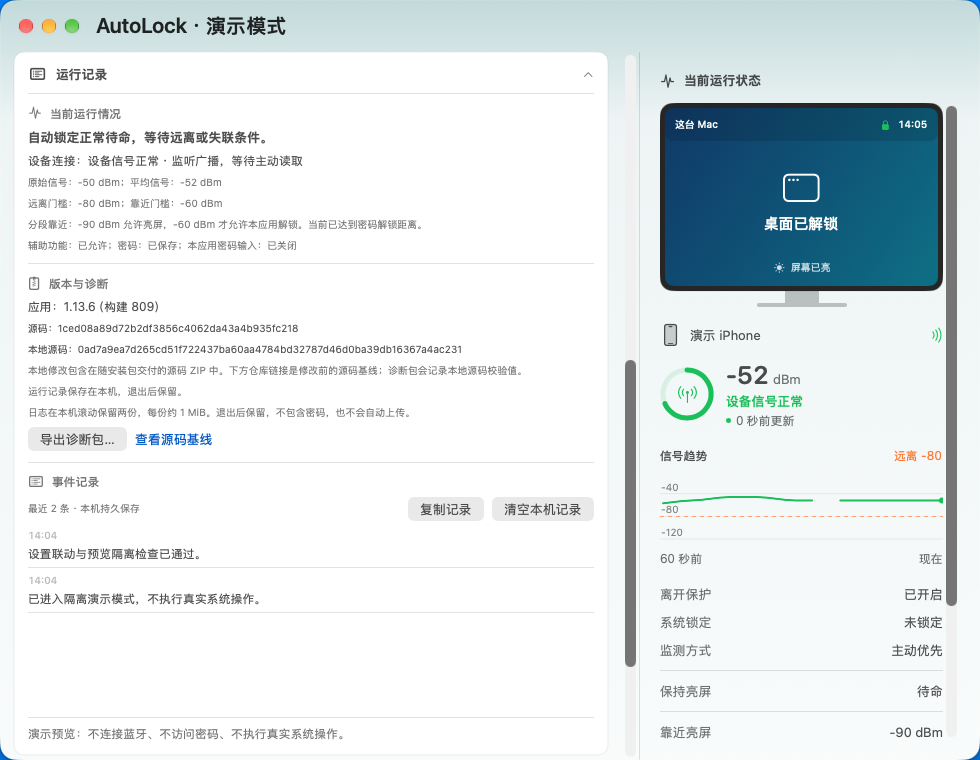
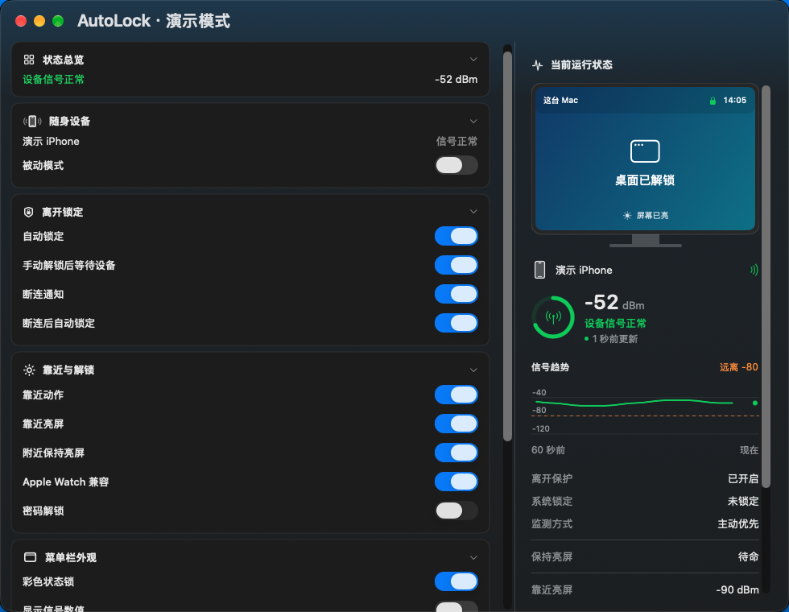
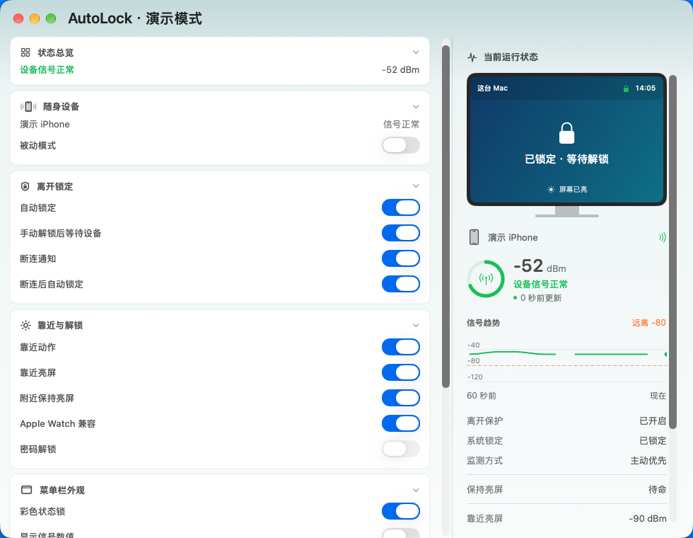
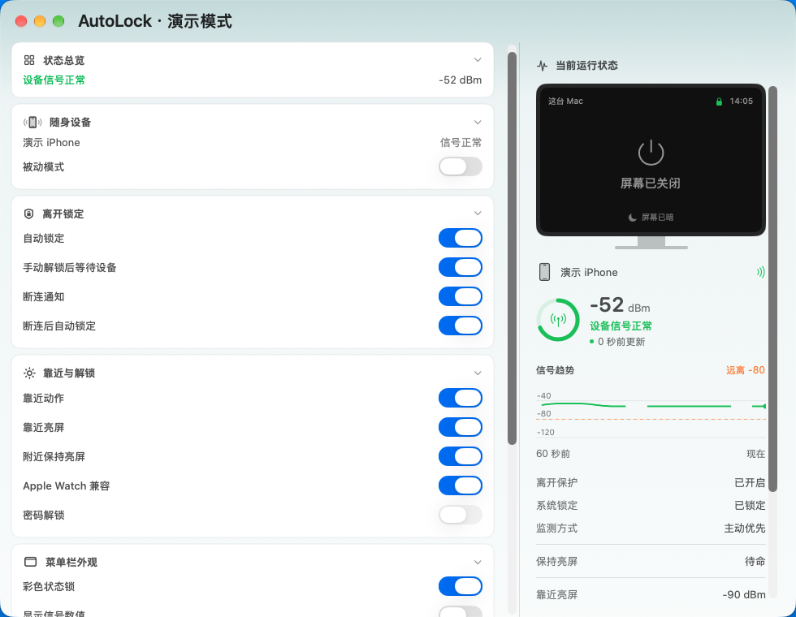
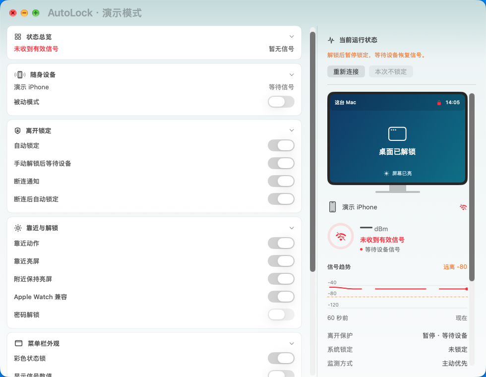

# AutoLock · 中文自动锁定工具

离开时自动锁定 Mac；回来时可以只唤醒屏幕，把解锁交给 Apple Watch、Touch ID 或自己输入密码。

本项目由 [ts1/BLEUnlock](https://github.com/ts1/BLEUnlock) 1.12.2 改进而来，当前版本为 **1.13.6 中文版（构建 809）**。新增原生设置窗口、菜单栏红绿状态灯、分组开关、逐项解释和效果预览。应用、菜单、窗口、安装文件和诊断包统一使用 **AutoLock**，安装后为 `AutoLock.app`。为继承已有设置、钥匙串和登录项，内部应用标识继续使用原值。

> 1.13.6 修复设备不在附近时解锁后反复锁定：默认暂停自动锁定，继续扫描，直到所选设备再次提供有效信号；可在“离开锁定”中关闭这项行为。补齐未断连就返回、远离确认未结束就返回，以及熄屏后已有近处信号时的亮屏触发。亮屏请求会检查系统返回值、有限重试并确认屏幕状态，结果可在右侧和运行记录查看。透明顶部、紧凑单页设置与实时屏幕状态保留。

[下载 Apple 芯片安装包](https://github.com/JahanHe/AutoLock/releases/download/1.13.6/AutoLock-1.13.6-arm64.dmg) · [发布记录与源码](https://github.com/JahanHe/AutoLock/releases/tag/1.13.6)

## 实际运行窗口截图

下面是应用在 macOS 27 上实际运行的原生窗口合成截图。彩色衬底用于展示真实透背景效果；设备信号、锁定和关屏场景使用隔离演示数据，不操作真实系统，也不代表已经完成手机离开、唤醒或手表解锁验收。



同一窗口改放在橙色衬底前，顶部随背景变色；设置文字与开关不透明，保持可读：















## 首要功能与默认设置

**离开自动锁定是主要功能，不依赖密码解锁、Apple Watch 或辅助功能权限。**

- 平均信号低于 **-80 dBm** 并持续 **5 秒**：执行锁定。
- 连续 **6 秒**没有收到有效信号：先弹出断连通知，再等待 **15 秒**锁定。通知里可直接选择“本次不锁定”，不必打开设置。两段等待时间分别可调；已有自定义无信号超时会保留。关闭 Mac 蓝牙同样进入这个流程。
- 重新靠近，信号达到 **-90 dBm**：默认先尝试唤醒屏幕；达到 **-60 dBm** 才允许已主动开启的本应用密码解锁。两道门槛可以分别调整。
- **Apple Watch 兼容模式默认开启，应用输入密码默认关闭。** 升级到本版时也会先关闭旧版自动输入密码设置，可以在窗口里主动开启。
- 设备不在附近时手动解锁，默认暂停自动锁定，直到再次收到所选设备的有效信号；可关闭此选项。
- 新安装默认锁定后关闭屏幕；升级保留已有显示设置。

应用先请求系统锁定，再关闭屏幕或启动屏保。屏保不再替代锁定，也不依赖“屏保开始后多久要求密码”的设置。

RSSI 是蓝牙信号强度，单位为 dBm。-50 通常比 -80 更近，但无法精确换算成米数。身体遮挡、口袋、墙壁和手机广播方式都会影响判断。如果手机留在 Mac 旁边，应用仍会认为你在附近。

## 安装与开始使用

需要 **Apple 芯片 Mac（M1 或更新）**和 **macOS 13 或更新版本**。当前及后续安装包仅构建 `arm64`。本版适配当前 macOS 的原生窗口、通知和登录项接口。具体硬件上的自动锁屏、蓝牙唤醒和 Apple Watch 解锁需要按下方步骤实测。

安装包以[本仓库发布页](https://github.com/JahanHe/AutoLock/releases)或交付的中文测试包为准。[构建记录](https://github.com/JahanHe/AutoLock/actions)也提供编译产物。`brew install bleunlock` 安装的是上游版本，不是本分支。

1. 如旧版 BLEUnlock／MacAutolock 已开启“登录时启动”，先在旧版关闭，再退出旧版，避免两个版本同时处理蓝牙和锁屏。
2. 将 `AutoLock.app` 放入“应用程序”后打开。更名不会自动删除此前安装的 `BLEUnlock.app`，请避免旧版同时运行。本次本地测试包使用 Apple Development 证书签名，未经 Developer ID 分发签名与苹果公证；如果系统拦截，请在“系统设置 → 隐私与安全性”确认来源后允许打开，无需关闭系统安全保护。
3. 允许蓝牙访问。启动后自动显示设置窗口。
4. 点击“随身设备”卡片展开，点击“扫描附近设备（15 秒）”，选择随身携带的 iPhone 或其他兼容设备。
5. 等菜单栏锁图标变绿，展开“效果测试”，先点击“立即锁定”验证当前系统的锁屏能力，再做实际离开测试。
6. 将应用放在“应用程序”后，按需要在“其他设置”重新开启“登录时启动”。系统要求批准时，在登录项里允许。

首次使用无需保存密码。仅当主动启用“由本应用输入密码解锁”时，才需要保存 Mac 登录密码，并授予辅助功能权限。密码保存在系统钥匙串，不写进偏好设置或日志。

## 菜单栏状态灯

默认将状态颜色直接融入锁图标：绿色锁表示信号正常，红色锁表示异常；菜单文字、悬停说明及辅助功能标签解释原因。关闭“状态颜色融入锁图标”后，可使用原来的独立状态灯。

| 状态 | 含义 |
| --- | --- |
| 绿灯 | 已选择设备、Mac 蓝牙可用，并持续收到有效信号。主动读取和被动接收广播都算正常。 |
| 红灯 | 尚未选择设备、蓝牙关闭或权限不可用、没有有效信号，或信号已超时。窗口显示具体原因。 |

灯色表示**监测状态**，不表示屏幕是否锁定。设备远离但仍在发出有效信号时，灯仍可以是绿色，离开锁定照常执行。

可以在“菜单栏外观”修改灯色、大小、间距，也可只显示灯、只显示锁图标，或附带 RSSI 数值。默认依旧是绿灯正常、红灯异常。

菜单栏可直接切换离开自动锁定、断连后自动锁定、靠近动作、靠近亮屏、附近保持亮屏和 Apple Watch 兼容模式；“更多设置”提供被动模式、断连通知、锁定后关屏、媒体、Dock、信号数值和登录启动。勾选状态与窗口设置同步，相关选项关闭时联动禁用。“更多设置”还可切换“手动解锁后等待设备”。设备扫描、日志、效果测试和权限入口会直接展开对应设置，保留重新连接、本次断连不锁定、立即锁定、关于和退出。

## 设置窗口的分组

取消最左侧分类，所有设置集中在一个可连续向下滚动的页面。顶部显示 AutoLock，采用原生统一工具栏，让红黄绿按钮与应用内容共用顶部区域；顶部使用透出桌面或后方窗口的原生毛玻璃，向下渐变过渡到设置区，保留拖动窗口、关闭、最小化和全屏。效果层不接收点击，不阻挡窗口按钮和设置操作。菜单快捷入口仍可跳到对应设置。卡片按内容紧凑排列，功能名称和开关左右对齐，没有固定高度留白。**收起时只显示必要名称、常用开关和当前状态，不显示说明小字、数值输入或详细操作；点击卡片标题或空白处展开后，才显示完整设置、设备扫描、参数调整、测试按钮和解释。** 分组内部仅用分割线，不嵌套卡片。设置即时保存，右侧用 Mac 屏幕示意、信号强弱环、最近 60 秒曲线和倒计时进度条展示实时状态，再配合设备、权限和条件文字；异常原因、断连倒计时及“本次不锁定”入口始终可见。“查看运行记录”会直接展开日志。效果模拟在“效果测试”展开后按需打开，不操作真实系统。

| 分组 | 内容 |
| --- | --- |
| 状态总览 | 当前信号和监测状态；展开后显示运行判断和操作反馈。 |
| 随身设备 | 扫描、选择设备、被动模式、列表最低信号强度。一次监测一台设备。 |
| 离开锁定 | 自动锁定开关、远离门槛、确认时间、断连通知、无信号确认时间、提醒后的锁定等待、“本次不锁定”、断连时不锁定选项、锁定后关闭屏幕或启动屏保。 |
| 靠近与解锁 | 附近持续亮屏开关、靠近动作开关、独立的亮屏与密码解锁门槛、Apple Watch 兼容模式、可选密码解锁与密码保存。 |
| 菜单栏外观 | 显示或隐藏状态灯、锁图标和信号数值；调整正常/异常颜色、灯的大小和间距。至少保留图标或状态灯之一。 |
| 运行记录 | 原始与平均信号、当前采样方式、判断条件、权限和密码状态；最近 100 条事件可复制；持久日志退出后保留，可导出诊断包或清空。 |
| 其他设置 | 登录时启动、启动时显示窗口、Dock 图标、关窗隐藏 Dock、分别控制媒体暂停与恢复、锁定通知、更新提醒，以及权限入口。 |
| 效果测试 | 真实锁屏、关屏、唤醒、屏保、媒体、通知，以及锁定后延时测试靠近动作。 |

远离门槛可调为 -99 至 -6 dBm，亮屏门槛为 -99 至 -6 dBm，密码解锁门槛为 -94 至 -1 dBm；亮屏门槛须比密码解锁门槛低至少 5 dBm，远离与密码解锁门槛也保持至少 5 dBm 间隔。远离确认时间为 1 至 300 秒，失联超时为 1 至 600 秒，保留上游的最长计时范围；支持直接输入数值和步进调整。信号变弱和完全失联分别计时；断连提醒后的等待也可设为 1 至 600 秒。关闭“断连提醒后自动锁定”只停用断连锁定，持续变弱触发的远离锁定继续生效。

列表最低信号强度只影响发现新设备的筛选，不改变已选设备的监测范围。

### 运行过程如何查看

信号曲线只使用当前设备的实际采样，保留最近 60 秒、最多 240 个样本；切换设备时清空，缺失或无效采样以及超过 6 秒的间隙不会连成连续曲线。橙色虚线表示远离锁定门槛，信号环只表示相对强弱，不能换算为米数。没有有效信号时环清空并显示异常状态，历史曲线仍可用于观察刚才的变化。界面每秒刷新信号年龄和倒计时；系统开启“减少动态效果”时关闭信号环过渡动画。

顶部透明使用 [NSVisualEffectView 的窗口后方混合](https://developer.apple.com/documentation/appkit/nsvisualeffectview/blendingmode-swift.enum/behindwindow)，窗口底色也设为透明。背景颜色会随桌面或后方窗口变化，文字和按钮保持清晰；系统开启“减少透明度”时遵循系统的不透明外观，不擅自修改用户的辅助功能设置。

右侧屏幕是系统状态示意，不录制或复制桌面画面，也不需要屏幕录制权限。启动、窗口激活和每秒刷新时读取系统锁定状态及主显示器休眠状态，同时响应系统锁定、解锁、亮屏、关屏和屏保通知；请求尚未完成时显示等待系统确认。信号颜色和屏幕锁定分别表达：手机断连会变红，但不会让示意屏幕凭空显示已锁定。多显示器时亮屏状态以主显示器为准；整机睡眠时进程可能停止刷新，唤醒后恢复。

窗口融合使用 [macOS 原生透明标题栏](https://developer.apple.com/documentation/appkit/nswindow/titlebarappearstransparent) 与统一工具栏，保留系统窗口按钮；没有绘制假按钮替代系统操作。

“状态总览”显示当前监测是否正常、设备距离判断、最近有效信号时间、主动/被动采样方式、远离锁定倒计时和无新信号时的兜底倒计时。锁定请求发出后会读取系统锁屏状态，区分“正在请求”“系统确认已锁定”和“未观察到锁定”。

“运行记录”记录开始监测、连接和回退、远离计时、信号恢复取消计时、失联、请求锁定、系统确认唤醒/解锁、开关导致的跳过及操作错误。记录不包含密码；蓝牙设备名称或标识会按实际显示。窗口显示最近 100 条事件；完整近期记录在本机滚动保存两份日志，每份约 1 MiB，退出后保留，超过容量会轮转。日志写入失败也会显示原因，不会悄悄吞掉。它不是无限保留的审计系统。

默认开启“手动解锁后等待设备”：当设备不在附近、尚无采样或采样已过期时，系统确认解锁后立即取消待执行的锁定，继续扫描，在所选设备下一次有效信号到来前不再自动锁屏。右侧与菜单显示“解锁后暂停锁定，等待设备恢复信号”，开始和结束均有日志。macOS 不告知解锁来源，因此同样适用于 Touch ID 和 Apple Watch 解锁。恢复的是有效采样，不是单纯连接成功；无效采样与重开蓝牙不会解除暂停。恢复后若信号仍弱，会按正常远离确认时间重新判断。关闭此选项、重启应用或更换设备会恢复常规监测；设备原本在附近的正常解锁不会暂停保护。已点击“本次不锁定”的断连仍保留到有效信号恢复。

### 被动模式是什么意思

默认模式会尝试连接所选设备，定期读取信号；连接不稳定时回退到接收广播。被动模式只接收设备广播，不主动建立连接，包括扫描列表时也不主动查询设备服务。

被动模式可以减少持续连接带来的蓝牙占用，但广播间隔可能较长。优先保证离开锁定时建议先测试默认主动模式；如果蓝牙键鼠或热点受到影响，再试被动模式，并按实测调整失联超时。未知设备名称可能显示标识或地址。

## 与 Apple Watch 如何配合

推荐选择 **iPhone 作为监测设备**，并保留以下设置：

- 离开自动锁定：开启。
- 靠近动作、靠近唤醒屏幕：开启。
- 锁定后关闭屏幕：开启。
- Apple Watch 兼容模式：开启。

亮屏门槛只控制 AutoLock 的亮屏请求；密码解锁门槛只约束本应用输入密码。Apple Watch 可能在亮屏后由 macOS 直接解锁。若要严格按两个距离阶段解锁，需要自行在系统设置中关闭 Apple Watch 自动解锁，再按需启用本应用密码输入。

这个模式下，本应用不会读取解锁密码、模拟按键或按 Esc。它只请求锁定和唤醒，Apple Watch 验证与解锁由 macOS 自己处理，不会同时抢着输入密码。

还需要在系统设置的“触控 ID 与密码”或“登录密码”中启用 Apple Watch 解锁，并佩戴已解锁的手表。首次开机、重启或注销后仍需要手动输入密码。是否能完成手表解锁取决于系统条件，不是连接一块手表就必然成功。参阅[苹果官方说明](https://support.apple.com/zh-cn/102442)。

如果不使用 Apple Watch，可关闭兼容模式，再按需开启“由本应用输入密码解锁”。不输入密码也不影响离开锁定。蓝牙信号本身不验证持有人身份，不应当把可选密码输入视为安全认证。

### 唤醒能力的边界

靠近唤醒要求应用仍在运行，并能收到新蓝牙信号。显示器关闭时可以继续监测；Mac 整机深度睡眠、合盖休眠、关机或重启前登录阶段，不能保证应用仍在运行和扫描。本应用不会通过持续阻止系统睡眠来保持监测。

即使开启“靠近唤醒”，也不表示能够唤醒关机的 Mac。系统唤醒后会恢复扫描，密码输入前会再次检查设备、开关、权限和屏幕状态。同一次锁定最多尝试一次密码输入，避免反复输入；解锁后或重新保存密码后才允许下一次尝试。

## 附近保持亮屏与断连通知

“附近保持亮屏”使用 macOS 原生空闲显示器休眠抑制，不会修改系统电源设置。收到 6 秒内的有效新信号，且原始值、平均值都达到附近门槛时保持屏幕亮着。附近门槛取亮屏与远离门槛中较近的一档，默认 -80 dBm，优先保证离开锁定。失联、离开、锁屏、主动关屏、系统休眠、关闭开关或退出应用时释放；右侧显示是否正在生效，失败原因写入日志。

突然断连不等于已经离开：蓝牙无法可靠判断手机是否还在桌上。因此断连后先提醒“请手动连接”，默认再等 15 秒。屏幕通知的操作菜单中可选“本次不锁定”，应用无需弹出窗口；也可选“重新连接”。macOS 可能在悬停通知后才显示操作按钮，通知被专注模式隐藏或权限未允许时，菜单栏和右侧状态仍提供同样的取消入口。

“本次不锁定”持续到下一次有效信号恢复；恢复后重新启用距离保护，下一次断连重新按策略处理。设置里的“断连提醒后自动锁定”可永久关闭断连锁定，同时保留离开锁定。重新连接按钮不会重置或延长倒计时。最后一条弱信号随后中断时，不凭过期样本立即锁定，转入断连确认。

## 权限的实际检测

辅助功能状态使用系统接口检测**当前运行进程**，每秒、回到应用窗口时自动复查，也可点击“重新检测权限”。只有系统实际返回已授权才显示通过，并记录最近检测时间与结果。它不会把系统设置里看到的一个同名开关直接当作本进程已授权。

本地测试版显示名为“AutoLock测试”，与旧安装版 AutoLock 分开。旧临时签名按二进制哈希识别，每次编译可能改变身份；后续本地联调使用本机现有 Apple Development 签名保持更新身份稳定。首次从临时签名切换后，系统可能需要为当前应用重新授权，可用“查看当前应用位置”核对。检测不到授权时仍保留离开锁定和亮屏，只有本应用输入密码需要辅助功能。

## 效果预览与真实测试

右侧始终显示当前真实运行状态。“效果测试”页的“展开模拟预览”只显示模拟画面，调整开关能立即看到对应说明。

分段亮屏在有效信号进入亮屏范围或失联后恢复时触发，不再受“远离确认是否结束”限制。如果从未跌出亮屏范围，远离锁定后回到“远离门槛 + 5 dBm”（且达到亮屏门槛）也会亮屏，例如 -85 → -75 dBm。这个回差防止持续弱信号导致刚锁定就反复亮屏。屏幕熄灭后已在附近的设备，下次有效采样达到密码解锁门槛时也会补一次亮屏，不必先走远；是否输入密码仍完全由密码开关和 Apple Watch 兼容模式决定。主动点击“立即锁定”的保护继续有效。

亮屏使用苹果的 [IOPMAssertionDeclareUserActivity](https://developer.apple.com/documentation/iokit/1557127-iopmassertiondeclareuseractivity) 接口，检查错误码，最多发送 3 次，并读取系统显示器状态确认结果；右侧与诊断日志会区分“已请求”“已确认”和失败。仅有请求日志不代表亮屏成功。系统深度睡眠、合盖或关机时程序无法持续扫描，这些情况不能保证靠近唤醒；不会为此改动系统电源配置。

“效果测试”分组中的按钮会真实操作当前 Mac。测试前请确保知道自己的登录密码。

1. **立即锁定：** 确认确实进入系统锁屏，再手动解锁。
2. **离开锁定：** 带手机离开，等待远离确认或失联超时。若锁得太晚，可适当提高远离门槛或缩短超时。
3. **关蓝牙兜底：** 设备信号正常后关闭 Mac 蓝牙，先看到断连提醒与倒计时，可在通知中点击“本次不锁定”验证取消；恢复蓝牙后检查绿灯与保护恢复，再测试未取消时的锁定。
4. **靠近唤醒：** 开启锁定后关屏，离开并锁定后再回来，观察屏幕是否点亮。
5. **Apple Watch：** 保持兼容模式开启，在系统中启用手表解锁，佩戴已解锁的手表观察结果。
6. **手动解锁暂停：** 设备保持离开且无信号，手动解锁，确认菜单及右侧显示暂停，超过原锁定时限也不再锁屏；带回设备后确认保护恢复。
7. **可选密码解锁：** 最后再单独开启并测试，不需要与手表同时使用。

“测试断连通知（不锁屏）”可检查屏幕通知里的按钮，点击按钮会写入运行记录，不断开实际设备、不锁定屏幕。

“锁定，5 秒后测试靠近动作”会锁屏，然后在设备仍近、信号有效、开关允许的情况下请求返回动作。Apple Watch 模式只请求唤醒；关闭靠近动作或设备失联时取消后续操作。

“立即锁定”会阻止设备一直在身边时被本应用马上重新解锁。离开再回来才会恢复靠近动作，也可手动解锁。

媒体暂停恢复依赖播放器是否支持系统媒体控制，只恢复由本应用暂停的播放。屏保、媒体和锁屏沿用了上游的部分系统接口；当前系统的真实结果请以效果测试为准。

## 常见问题

**找不到设备：** 将手机靠近 Mac，确认蓝牙权限和蓝牙开关，点击扫描，适当降低列表门槛。随机变化且系统无法解析的蓝牙地址无法保证持续跟踪。

**红灯却没有立刻锁定：** 尚未选设备时不会锁定。已选择设备后，确认“离开自动锁定”和“断连提醒后自动锁定”均已开启；断连需要先确认无信号再等待宽限，或当前已经选择“本次不锁定”。

**手机还在旁边却锁定：** 查看是平均信号过低，还是广播中断。分别调低远离门槛、延长确认时间或失联超时。不能用固定距离假设代替实际校准。

**能锁屏但不输入密码：** 默认就是如此。检查是否仍启用 Apple Watch 兼容模式，或者关闭了靠近动作。主动使用密码解锁还需要正确密码、钥匙串访问和辅助功能权限。

**更新后权限或钥匙串需要重新允许：** 测试版本的签名变化可能让 macOS 重新确认权限。只锁定和唤醒不需要保存密码，密码变更时请同步更新钥匙串条目。

**窗口关掉后还工作吗：** 会。窗口支持关闭、最小化和调整大小，使用普通窗口层级。在当前系统忽略原生最小化请求时，黄色按钮会将窗口收起到后台，仍可通过已开启的 Dock 图标或菜单栏恢复；日志会说明实际采用的方式。关闭窗口只收起界面，监测继续；右侧状态可以再次打开查看。“其他设置”可选择是否显示 Dock 图标，以及关窗后是否隐藏 Dock，默认关窗后只保留菜单栏。菜单中“退出”才停止监测。

**怎样检查更新：** 启动和解锁等时机检查本仓库最新正式版本，成功检查后至少间隔 24 小时。仅更新版本更高时通知，不自动下载安装。无正式发布时不提醒。

## 锁定和解锁事件脚本

可在 `~/Library/Application Scripts/jp.sone.BLEUnlock/event` 放置可执行脚本。第一个参数说明事件类型；有信号记录时，第二个参数为最近显示的 RSSI。

| 参数 | 含义 |
| --- | --- |
| `away` | 设备远离，系统已确认锁定。 |
| `lost` | 设备失联，系统已确认锁定。 |
| `unlocked` | 应用输入密码后 10 秒内收到系统解锁事件。 |
| `intruded` | 解锁事件未被归为本应用的密码解锁，包括合法的 Apple Watch、Touch ID 或手动解锁，不表示有人入侵。 |

关闭“靠近后执行动作”时，不运行 `intruded` 事件。`unlocked` 使用时间窗口关联，不是系统提供的密码认证来源证明。脚本通知、拍照等扩展需自行配置，并非内置功能。

## 编译与检查

完整编译界面资源需要 Xcode。行为检查只需 Command Line Tools，不连接蓝牙、不操作屏幕。

仅修改 Swift/C/Objective-C 代码时，可以用 `scripts/build_local.sh /绝对路径/资源模板.app /绝对路径/AutoLock.app [签名证书]` 在本机重编译主程序和登录启动器，默认使用临时签名。模板必须来自相同界面与图标源码的可信构建；脚本会复用编译后的 nib 和图标，修改这些资源后必须先用 Xcode 重编译，不能继续复用旧模板。本次界面资源沿用 1.13.1，SwiftUI 页面和所有代码按 1.13.6 重编译。包内 `Contents/Resources/源码构建信息.json` 记录源文件校验值与资源基线；运行记录和导出的诊断包包含本地源码校验值。本次源码与 README 已同步到本仓库，发布标签 `1.13.6` 对应相同源码；安装包内记录该提交与源码校验值。

```sh
python3 scripts/check_localization.py
scripts/check_behavior.sh
xcodebuild -project AutoLock.xcodeproj -scheme AutoLock \
  -configuration Release -derivedDataPath build \
  CODE_SIGNING_ALLOWED=NO ARCHS=arm64 ONLY_ACTIVE_ARCH=NO build
python3 scripts/check_localization.py build/Build/Products/Release/AutoLock.app
```

GitHub Actions 执行同样的检查，并提供中文测试产物。编译成功不代表已完成硬件验收。

应用支持隔离演示模式：

```sh
build/Build/Products/Release/AutoLock.app/Contents/MacOS/AutoLock --preview
```

演示模式使用独立临时偏好，不创建蓝牙管理器、不访问登录密码、不注册登录项，也不会执行锁屏、按键、通知、脚本或屏幕操作。可追加 `--capture /绝对路径/预览目录` 运行 69 项开关联动与隔离检查、1 项分组跳转检查，并导出真实窗口的浅色、深色、各分组及失联截图，随后自动退出，共 16 张截图。加上 `--capture-composited` 可使用 macOS 合成截图，并创建隔离的彩色背景窗口来验证透明效果，仅截取本应用窗口；此截图检查需要系统允许执行截图，正常使用 AutoLock 不需要录屏权限。窗口按钮可用 `AutoLock.app/Contents/MacOS/AutoLock --preview --check-window` 单独运行 4 项最小化／收起、关闭和恢复检查。也可运行 `scripts/check_preview.sh /绝对路径/AutoLock.app /绝对路径/预览目录` 自动核对全部截图。

## 发生错误后如何追溯和反馈

打开“运行记录”，先看中文事件时间线与最近错误，再点击“导出诊断包”。诊断 ZIP 包包含：

- 应用版本、构建号、系统版本和编译时对应的 Git 提交。
- 当前监测状态、采样方式、锁屏状态、必要权限和功能设置。
- 最近事件，以及轮转保留的近期运行记录。
- 中文说明，便于带回 Codex 任务或交给维护者排查。

包内不包含登录密码，不会自动上传。设备名称可能出现在事件中，分享前可先查看。请同时描述“做了什么、原本期待什么、实际发生什么、发生时间”，诊断中的源码提交可以在[本仓库](https://github.com/JahanHe/AutoLock/commits/master)定位到对应版本，继续复现和修改。

本机日志目录为 `~/Library/Application Support/jp.sone.BLEUnlock/诊断/`。在窗口点击“清空本机记录”会清理这两份记录，后续继续记录。隔离演示模式不会读写真实运行日志。

当前本地版本通过 134 项行为与日志检查，包括设备缺席解锁暂停、有效信号恢复、开关回退和三类亮屏漏触发回归。自动检查覆盖断连宽限、通知取消使用的真实计时器、恢复保护、过期弱信号防误锁、保持亮屏的生效与释放条件，以及信号无效、阈值、失联、关闭蓝牙、重新解锁、Apple Watch 密码互斥，以及日志持久化、轮转、压缩导出、清空和错误返回。蓝牙广播、系统深度睡眠、私有系统接口和 Apple Watch 的实机表现仍要按验收步骤测试，不能以“编译通过”代替稳定性验证。

## 来源与中文呈现约定

原作者为 Takeshi Sone，感谢中文翻译贡献者 peiit 及所有上游贡献者。完整历史见[原项目](https://github.com/ts1/BLEUnlock)。

本项目采用 MIT 许可证。[许可说明](LICENSE)包含完整中文参考译文，并保留必须附载的原始英文许可及图标来源声明，同时随应用打包。图标源自 materialdesignicons.com，由 Google LLC 设计，采用 Apache 2.0 许可证。

界面、文档、注释、运行日志和脚本说明统一使用简体中文。程序标识符、系统接口、协议字段、配置键、路径、命令、设备自定义名称和品牌保留原样。macOS 自带弹窗和系统错误的语言由操作系统决定。
